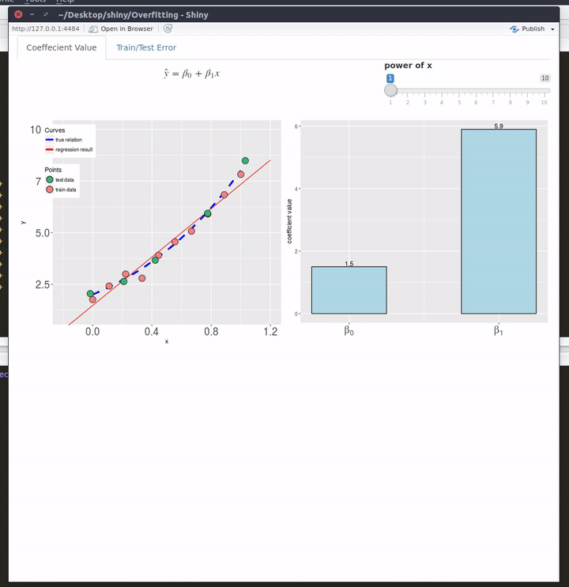

# shiny_Overfitting
A shiny application to display effects of overfitting

Please install packages ``shiny``, ``ggplot2``, ``latex2exp``, ``corpcor``, before running code

```R
library(shiny)
runGitHub('shiny_Overfitting', 'lyokka')
```


